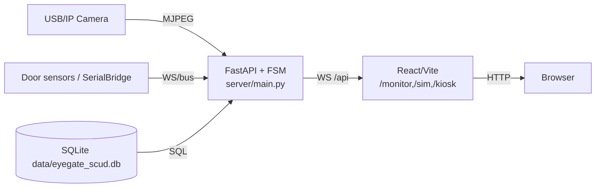
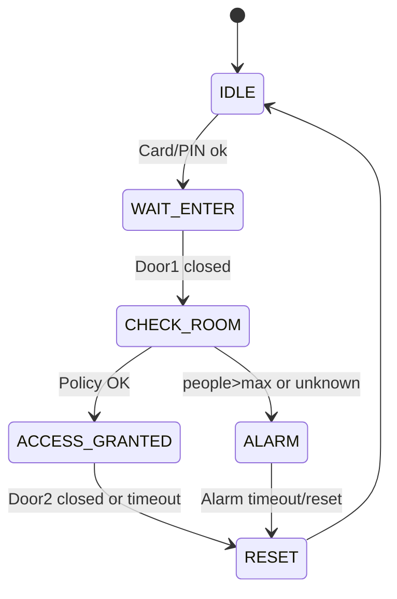

<!-- Расчетно-пояснительная записка (РПЗ) для EyeGate Mantrap -->

# Титульный лист
- Проект: **EyeGate Mantrap SCUD**
- Выполнил: ____________________
- Группа: ____________________
- Руководитель: ____________________
- Город, дата: ____________________

## Содержание
1. Введение
2. Назначение и область применения
3. Исходные данные и допущения
4. Нормативные ссылки и термины
5. Анализ процесса доступа и постановка задачи
6. Аппаратная архитектура и состав
7. Логика функционирования и конечный автомат
8. Протоколы обмена и синхронизация
9. Расчеты временных параметров и допусков
10. Надежность и анализ отказов (FMEA)
11. Программное обеспечение (архитектура backend/frontend, БД, vision)
12. Безопасность (модель угроз, меры)
13. Монтаж, эксплуатация и обслуживание
14. Программа и методика испытаний
15. Технико-экономическое обоснование
16. Охрана труда и экология
17. Результаты испытаний и заключение
18. Список источников
19. Приложения (A–F)

## 1. Введение
EyeGate Mantrap — учебный стенд СКУД для шлюзовой камеры (mantrap) с двумя дверями, проверкой людей и лиц. Реализация: FastAPI backend (`server/main.py`), React/Vite SPA (`web/app/src`), FSM (`gate/fsm.py`, `gate/controller.py`), vision (`vision/service.py`), БД SQLite (`data/eyegate_scud.db`), симулятор дверей (`hw/simulated.py`), датчики через SerialBridge (`hw/serial_bridge.py`).

## 2. Назначение и область применения
- Учебный прототип СКУД с проверкой по PIN/карте + анализ помещения (силуэты + лицо).
- Демонстрация интеграции камер (MJPEG), датчиков дверей, автодоводчиков и WS мониторинга.
- Не предназначен для промышленного использования (отсутствует резервирование, нет PAD).

## 3. Исходные данные и допущения
- Кодовая база из репозитория (ветка текущая).
- Камера: MJPEG поток `/api/video/mjpeg` или заглушка VisionServiceDummy.
- Пользователи и события в SQLite (`db/models.py`, таблицы users/events/settings).
- ENV по `.env.example`: `VISION_MODE=real|dummy`, `EYEGATE_DUMMY_HW=1`, `DOOR_AUTO_CLOSE_SEC` и др.
- Клиент SPA, маршруты: `/kiosk`, `/monitor`, `/sim`, `/admin`, `/enroll`.

## 4. Нормативные ссылки и термины
- FastAPI docs (streaming responses, WebSocket).
- OpenCV YuNet/SFace (детекция/распознавание лиц).
- ГОСТ 34 серии (структура РПЗ) — применено формально.
- Термины: FSM (конечный автомат), MJPEG, WS (WebSocket), PAD (presentation attack detection, не реализовано).

## 5. Анализ процесса доступа и постановка задачи
Последовательность: предъявление PIN/карты → FSM открывает Door1 → после закрытия Door1 запускается анализ помещения (силуэты + лица) → решение policy → либо ACCESS_GRANTED (Door2 unlock/open), либо ALARM/deny. Требования:
- Один источник видео: backend MJPEG, без `getUserMedia` (см. `/monitor` реализацию в `web/app/src/pages/MonitorPage.tsx` и компонент `MjpegStream`).
- Отображение боксов и подписи имен/UNKNOWN из WS `/ws/status`.
- Сохранность пользователей при `uvicorn --reload`.
- Автодоводчики для обеих дверей в симуляторе.
- Поддержка датчиков по сериал протоколу (Proteus-ready).

## 6. Аппаратная архитектура и состав
- Контроллер: Luckfox Pico Ultra (допущение), GPIO для замков/датчиков (реальные драйверы в `hw/doors.py`).
- Симулятор: `hw/simulated.py` (door1/door2, замки, сенсоры, автодоводчики).
- Камера: OpenCV VideoCapture (реальный) или dummy плейсхолдер.
- Датчики: SerialBridge (`hw/serial_bridge.py`), протокол строк/JSON; либо симулированные сенсоры.
- Deployment (Mermaid):


## 7. Логика функционирования и конечный автомат
- FSM реализации: `gate/fsm.py`, управляется `gate/controller.py`.
- Состояния: IDLE → WAIT_ENTER → CHECK_ROOM → ACCESS_GRANTED или ACCESS_DENIED/ALARM → RESET.
- Диаграмма (Mermaid):

- Таблица состояний FSM (фрагмент):

| State | Входное событие | Условие | Действие | Следующее |
| --- | --- | --- | --- | --- |
| WAIT_ENTER | Door1 closed | стабилизация `door1_close_stabilize_ms` | start room analysis | CHECK_ROOM |
| CHECK_ROOM | анализ завершен | policy OK | unlock/open Door2 | ACCESS_GRANTED |
| CHECK_ROOM | анализ завершен | policy FAIL | alarm_on | ALARM |
| ACCESS_GRANTED | Door2 closed или timeout | – | lock both | RESET |

## 8. Протоколы обмена и синхронизация
- REST FastAPI (`server/api`): см. Приложение B. Ключевые:
  - `GET /api/status/` — статус шлюза (GateStatus, включает vision, doors, policy).
  - `POST /api/status/reset` — сброс FSM (admin).
  - `POST /api/auth/pin` — вход по PIN (kiosk).
  - `POST /api/auth/login`, `/api/auth/admin/login`.
  - `POST /api/users/` — создание пользователя.
  - `GET /api/video/mjpeg` — MJPEG поток; `GET /api/video/snapshot`.
  - Сим: `POST /api/sim/door/{id}/open|close`, `/api/sim/auto_close`.
- WS `/ws/status` (`server/ws.py`) — JSON snapshot из `GateController.snapshot()`. Поля vision включают `faces[{box,user_id,score,label,is_known,frame_w,frame_h}]`.
- SerialBridge протокол (`hw/serial_bridge.py`): строки `D1:OPEN`, `D2:CLOSED` или JSON `{"door":1,"closed":true}`.
- Интерфейсы (фрагмент):

| Источник | Приемник | Протокол | Данные | Назначение |
| --- | --- | --- | --- | --- |
| VisionServiceOpenCV | /api/video/mjpeg | multipart/x-mixed-replace | JPEG кадры | Видео в монитор |
| SerialBridge | GateController | callback/async | door, is_closed | События датчиков |
| GateController | WS /ws/status | JSON | GateStatus | UI мониторинг |

## 9. Расчеты временных параметров и допусков
- Таймауты FSM: `enter_timeout_sec=15`, `check_timeout_sec=10`, `exit_timeout_sec=15`, `alarm_timeout_sec=60` (см. `server/config.py`, `GateConfig`).
- Стабилизация после закрытия Door1: `door1_close_stabilize_ms=1500`.
- Анализ помещения: `room_check_samples=5`, шаг 0.1 с → ~0.5–1.0 с окно принятия решения.
- Автодоводчики (сим): `DOOR_AUTO_CLOSE_SEC`/`DOOR1_AUTO_CLOSE_SEC`/`DOOR2_AUTO_CLOSE_SEC` (конфиг в секундах, преобразуется в мс). Проверка тестом `tests/test_api_sim.py`.
- Vision: `VISION_TTL_SEC` (стейл кадр), `VISION_MATCH_THRESHOLD` (по умолчанию 0.6). При стейл/ошибке камера считается down, Door2 не открывается (UI показывает CAMERA DOWN).

## 10. Надежность и анализ отказов (FMEA)
| Элемент | Отказ | Причина | Последствие | Обнаружение | Меры |
| --- | --- | --- | --- | --- | --- |
| Камера (OpenCV) | нет кадра | кабель, драйвер | Vision OFF, Door2 не откроется | vision_error в WS/status, UI CAMERA DOWN | Placeholder кадр, deny Door2 |
| БД SQLite | файл недоступен | путь неверен, lock | нет сохранения пользователей | исключение при init_db | Стабильный путь `data/eyegate_scud.db`, WAL, тест `test_db_persistence` |
| SerialBridge | нет событий | COM не открыт | сенсоры не обновляются | отсутствие изменений sensor1/2 | Режим sim по умолчанию; логика fallback |
| FSM | зависание таймера | event loop | время ожидания превышено | TIMEOUT события | Таймауты в GateConfig |

## 11. Программное обеспечение
### Backend
- FastAPI (`server/main.py`), роуты `/api` (`server/api/*.py`), WS `/ws/status` (`server/ws.py`).
- FSM и логика: `gate/controller.py` (действия, snapshot), `gate/fsm.py` (состояния, события).
- Vision: `vision/service.py` — OpenCV YuNet/SFace, PeopleCounter (`vision/people_count.py`), dummy режим (VisionServiceDummyControl). Поля snapshot: people_count, boxes, faces[{box,user_id,score,label,is_known}], frame_w/h, match, matched_user_id, recognized_user_ids.
- DB: SQLite, путь по умолчанию `data/eyegate_scud.db` (`db/base.py`, `db/init_db.py`), таблицы users/events/settings (`db/models.py`). Поля users: id, name, login, password_hash, pin_hash, card_id, is_blocked, access_level, face_embedding, role, status, approved_by/at, created_at/updated_at.
- SerialBridge: `hw/serial_bridge.py` (парсер + поток), конфиг через ENV `SENSOR_MODE`, `SENSOR_SERIAL_PORT`, `SENSOR_SERIAL_BAUD`.
### Frontend
- SPA (`web/app/src`), маршруты в `App.tsx`: /kiosk, /monitor, /sim, /admin, /enroll.
- Monitor: `pages/MonitorPage.tsx` + `components/MjpegStream.tsx` —  с авто-retry, overlay canvas по WS статусу, подписи имени или UNKNOWN красным, кнопка Debug overlay.
- Симулятор: `pages/SimPage.tsx` — управление дверями, отображение сенсоров/замков, автодоводчик (API `/api/sim/auto_close`).
- Admin/Enroll/Kiosk: формы для входа/создания/записи лица (enroll вызывает `/api/users/{id}/enroll`).

## 12. Безопасность
- Токены: JWT-like через `auth/tokens.py`, хранение в LocalStorage (frontend `lib/api.ts`).
- Admin: `ADMIN_LOGIN/ADMIN_PASS` env, X-Admin-Token опционально (`server/deps.require_admin`).
- Access policy: `policy/access.py` (tests `tests/test_policy.py`, `tests/test_controller_policy_integration.py`), учитывает people_count, recognized_user_ids, require_face_match_for_door2, max_people_allowed.
- Fail-safe: при vision_error или staleness (VisionServiceOpenCV.analyze_room) — face_match=NO_FACE, Door2 не открывается, ALARM возможен.

## 13. Известные проблемы и план исправлений
| ID | Симптом | Причина (код) | Фикс/статус | Проверка |
| --- | --- | --- | --- | --- |
| A | /monitor спрашивал камеру браузера | Старый getUserMedia (legacy static js) | Заменено на backend MJPEG `MjpegStream` (`MonitorPage.tsx`), auto-retry | R-1, `test_spa_fallback` |
| B | Пользователи терялись после перезапуска | `EYEGATE_DB_PATH` мог быть `:memory:`/temp | Жёсткий путь `data/eyegate_scud.db` (`db/base.py`), запрет memory fallback | `test_db_persistence` |
| C | FOV камеры не видно в /sim | UI без схемы | Описание схемы в RPZ Прил. E; план — добавить SVG/Canvas в `SimPage.tsx` | Ручной осмотр |
| D | Доводчик только для одной двери | Автозакрытие общее | Добавлены `DOOR1_AUTO_CLOSE_SEC`, `DOOR2_AUTO_CLOSE_SEC`, `SimulatedDoors.set_auto_close` | `test_api_sim` |
| E | Подписи “Face 1/2” | Жёстко заданный текст в vision annotate | Используются label из БД или UNKNOWN (`vision/service.py`), overlay в Monitor | `test_dummy_vision_v2`, R-2 |
| F | Нет Proteus/serial интеграции | Отсутствовал bridge | `hw/serial_bridge.py`, ENV `SENSOR_MODE=serial`, инструкция `docs/PROTEUS.md` | `test_serial_bridge`, R-4 |

## 14. Монтаж, эксплуатация и обслуживание
- Установка/запуск: см. `docs/INSTALL_RUNBOOK.md`.
- Быстрый старт dummy: `EYEGATE_DUMMY_HW=1`, `VISION_MODE=dummy`, `uvicorn server.main:app --reload`.
- Проверка MJPEG: открыть `/monitor`, в Network видно `/api/video/mjpeg`.
- Сервис: база в `data/`, при блокировке fallback на запасной файл (init_db).
- Enroll: `/api/users/{id}/enroll` или `/api/users/me/enroll` (для текущего токена).

## 15. Программа и методика испытаний
- См. `docs/TEST_PLAN.md` (кейсы по MJPEG, автодоводчикам, serial, persistence, policy).
- Автотесты: `tests/test_spa_fallback.py` (SPA), `tests/test_db_persistence.py`, `tests/test_api_sim.py`, `tests/test_serial_bridge.py`, `tests/test_dummy_vision_v2.py`, policy/vision/unit.

## 16. Технико-экономическое обоснование (оценочно)
- Затраты: одноплатный компьютер + камера + датчики + реле. ПО open-source. Экономия за счет простоты и отсутствия лицензий.

## 17. Охрана труда и экология
- Безопасное напряжение на реле/датчиках (допущение).
- Отсутствие биометрических данных в прод-среде (демо-embeddings dummy).
- При промышленном использовании требуется PAD и защита ПДн (не реализовано).

## 18. Результаты испытаний и заключение
- Автотесты пройдены (см. список выше).
- MJPEG работает через backend, без `getUserMedia`.
- Пользователи сохраняются между рестартами (тест `test_db_persistence`).
- Автодоводчики в симуляторе — тест `test_api_sim.py`.
- SerialBridge протокол протестирован (`test_serial_bridge.py`).
- Vision dummy снапшоты содержат label/is_known (`test_dummy_vision_v2.py`).

## 19. Список источников
- FastAPI docs: https://fastapi.tiangolo.com
- OpenCV YuNet/SFace: https://github.com/opencv/opencv_zoo
- JWT best practices (RFC 7519)
- ГОСТ 34.603–92 (структура РПЗ, формально)
- СКУД общие требования (обзорно)

## 20. Приложения
- A) Матрица трассируемости — `docs/TRACEABILITY_MATRIX.md`
- B) API спецификация — см. Приложение B раздел, и `server/api/*.py`
- C) Форматы WS/status — см. ниже JSON-шаблон
- D) ENV конфигурация — `.env.example`
- E) Скриншоты — Placeholder:
  - Рис. E.1 — /monitor: MJPEG, overlay лиц, статус справа
  - Рис. E.2 — /sim: двери, сенсоры, автодоводчики
  - Рис. E.3 — /kiosk: ввод PIN
  - Рис. E.4 — /admin: список пользователей
- F) Диаграммы — FSM/sequence/deployment (см. разделы 7 и ниже).

### Приложение C: Формат WS/status (JSON фрагмент)
```json
{
  "state": "CHECK_ROOM",
  "doors": {
    "door1_closed": true,
    "door2_closed": true,
    "lock1_unlocked": false,
    "lock2_unlocked": false,
    "sensor1_open": false,
    "sensor2_open": false
  },
  "vision": {
    "people_count": 1,
    "faces": [
      {
        "box": {"x":120,"y":80,"w":120,"h":120},
        "user_id": 7,
        "score": 0.42,
        "label": "demo",
        "is_known": true
      }
    ],
    "frame_w": 640,
    "frame_h": 480,
    "match": true,
    "matched_user_id": 7,
    "recognized_user_ids": [7]
  },
  "policy": {
    "max_people_allowed": 1,
    "allow_multi_known": false,
    "require_face_match_for_door2": true
  }
}
```

### Приложение B: Таблица API (фрагмент)
| Method | Path | Auth | Request | Response | Ошибки |
| --- | --- | --- | --- | --- | --- |
| GET | /api/status/ | optional | – | GateStatus | 401/500 |
| POST | /api/status/reset | admin | – | GateStatus | 401/403 |
| GET | /api/video/mjpeg | none | – | MJPEG stream | – |
| POST | /api/auth/pin | none | {pin} | {status,state,userId,login} | 401 |
| POST | /api/users/ | none | QuickUserPayload | UserOut | 400/409 |
| POST | /api/users/{id}/enroll | admin | – | UserOut | 400/404 |
| POST | /api/sim/door/{id}/open | none (sim) | – | SimState | 400 |
| POST | /api/sim/auto_close | none (sim) | {delay_ms[,door_id]} | SimState | 400 |

### Приложение A: Матрица трассируемости — см. `docs/TRACEABILITY_MATRIX.md`
