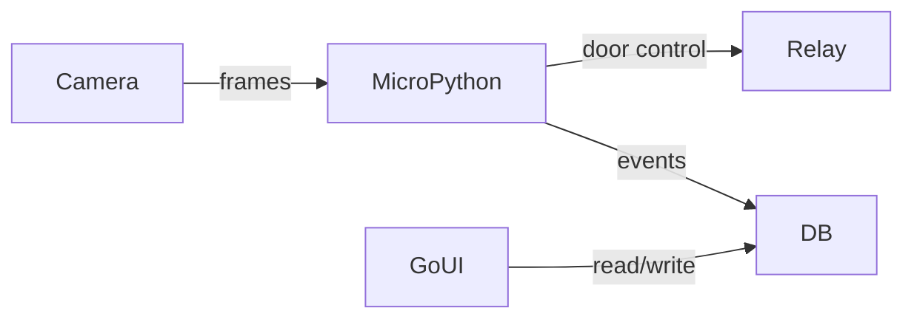

# Docs — EyeGate-L
Hardware/software block diagram and safety notes live here.
## Blocks

```mermaid
flowchart LR
  Camera[Camera] -->|frames| MicroPython[MicroPython]
  MicroPython[MicroPython] -->|door control| Relay[Relay]
  MicroPython[MicroPython] -->|events| DB[DB]
  GoUI[GoUI] -->|read/write| DB[DB]
```
